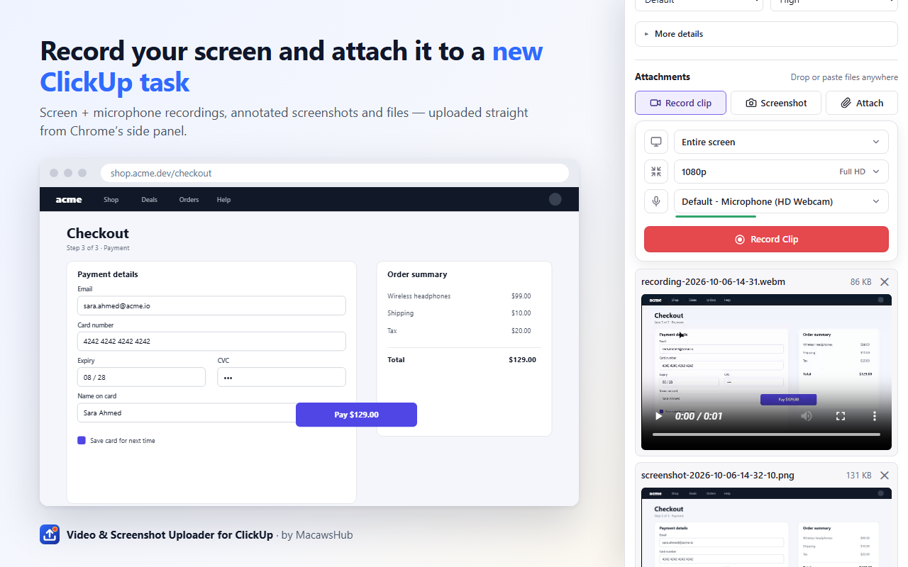

<p align="center"></p>

<h1 align="center">Video &amp; Screenshot Uploader for ClickUp</h1>

<p align="center">
  Record your screen or capture and annotate screenshots, then attach them to a new or existing ClickUp task — all from Chrome's side panel.
</p>

<p align="center">
  <a href="https://github.com/ElBedeawi/Clickup-Chrome-Extension/releases/latest"></a>
  <a href="https://github.com/ElBedeawi/Clickup-Chrome-Extension/actions/workflows/ci.yml"></a>
  <a href="LICENSE"></a>
  <a href="https://elbedeawi.github.io/Clickup-Chrome-Extension/privacy-policy.html"></a>
  <a href="https://buymeacoffee.com/wagih.elbedeawi"></a>
</p>



The official ClickUp Chrome extension can't attach videos to tasks. This one can, and it adds an annotation editor for screenshots too.

*Not affiliated with, endorsed by or sponsored by ClickUp. "ClickUp" is a trademark of its owner, used only to describe compatibility.*

## Features

- **Record clip:** your entire screen, a window or a tab, at 720p–4K or native resolution, with your choice of microphone and system audio. Keeps recording with the side panel closed.
- **Screenshots:** visible tab, a selected area or the entire screen, then draw, add text, blur sensitive details or crop.
- **Create a task** with title, Markdown description, status, priority, plus optional assignees, due date, tags and custom fields.
- **Add to an existing task:** paste a link or open the task and it's detected automatically, with an optional comment.
- **Private by design:** uses your own ClickUp API token, stored only in your browser. No servers, no analytics, no tracking ([privacy policy](https://elbedeawi.github.io/Clickup-Chrome-Extension/privacy-policy.html)).

## Install

The Chrome Web Store listing is on its way. Until then:

1. Download `video-and-screenshot-uploader-for-clickup-<version>.zip` from the [latest release](https://github.com/ElBedeawi/Clickup-Chrome-Extension/releases/latest) and unzip it.
2. Open `chrome://extensions` and turn on **Developer mode** (top right).
3. Click **Load unpacked** and select the unzipped folder.
4. Pin the extension and click its icon. The side panel opens.

Requires Chrome 123 or later.

## Set up your token

1. In ClickUp go to **Settings → Apps** (<https://app.clickup.com/settings/apps>) and copy your personal API token (`pk_...`).
2. Click ⚙ in the side panel (or open the extension's **Options**), paste the token, then **Save**. You should see "Connected as <your name>".

The token is kept in `chrome.storage.local` on this machine only. **Revoke** on the settings page removes it from the browser. To invalidate the token itself, regenerate it in ClickUp.

## Usage

**New task:** pick Workspace → Space → Folder (or "No folder") → List, enter a title and an optional Markdown description, status and priority. Then press **Create task & upload**.
- The panel opens on the list you used last.
- Each dropdown remembers your last pick inside each parent, and picks the only option automatically when there is just one.
- **More details** (collapsed by default) adds assignees, due date (optionally with a time), tags and custom fields. A badge shows how many are set.
- Supported custom field types: text, number, currency, email, URL, phone, date, checkbox, dropdown, labels and rating. Other types are listed so you can set them in ClickUp afterwards. Required fields are checked before submitting.

**Existing task:** open a task in ClickUp and the panel picks it up from the current tab. You can also paste a task URL, a task ID, or a custom ID like `DEV-123`, then press **Check**. **Add a comment** (collapsed) posts a comment after the upload. You can also post just a comment.

**Attachments**: a toolbar with three tools.
- **🎥 Record clip** opens the recording card:
  - **Source:** Entire screen, Window or Current tab. Chrome's share picker opens on the matching pane. Tick "Share audio" there to include system or tab audio.
  - **Resolution:** 720p (HD), 1080p (Full HD), 1440p (2K), 2160p (4K) or Native (Auto). The capture is scaled down to fit; bitrate follows the real size.
  - **Microphone:** "No microphone" or any of your devices, with a live level meter. Until the extension has mic permission, the list shows "Default microphone" and an option to allow access.

  Choices are remembered. Press **Record Clip** to start. You can **close the side panel while recording**: a red **REC** badge shows it's running. Stop with Chrome's "Stop sharing" bar, or reopen the panel and press **Stop**. Recordings are written to disk as they go, so long ones don't fill memory.
- **📷 Screenshot ▾** has three modes:
  - **Visible tab** captures the visible part of the current tab.
  - **Select area** lets you drag a rectangle on the page. Esc or a plain click cancels.
  - **Entire screen** captures a screen, window or tab via Chrome's picker.

  Each screenshot opens in an editor tab with **Draw**, **Text**, **Blur** (pixelates, safe for passwords and emails) and **Crop**. There are 8 colors, 3 sizes and undo/redo (Ctrl+Z / Ctrl+Shift+Z), with shortcuts P, T, B and C. An area selection opens already cropped; undo brings back the full screenshot.
- **📎 Attach** picks files. You can also drop or paste files (Ctrl+V) anywhere in the panel.
- Attachments you haven't uploaded are kept, even if you close the panel, until you upload or remove them.
- Recordings are WebM (VP9/Opus), which plays in ClickUp's viewer. ClickUp's limit is 1 GB per file.

If the task is created but an upload or the comment fails, the task link stays on screen and the button turns into **Retry**, so nothing is duplicated. Rate-limit responses (HTTP 429) are retried automatically.

### Microphone permission

Chrome usually can't show the microphone prompt inside a side panel. When that happens, the panel shows **Grant microphone access**. Click it, allow the mic in the tab that opens, then record again. You only need to do this once.

## Buy Me a Coffee link

If the extension saves you time, you can [buy me a coffee](https://buymeacoffee.com/wagih.elbedeawi) ☕.

For maintainers: the link is `BUY_ME_A_COFFEE_URL` in [lib/links.js](lib/links.js) (https://buymeacoffee.com/wagih.elbedeawi). It drives the compact button in the side panel footer and the "Support this extension" box in Settings; clearing it hides both. The button recreates Buy Me a Coffee's official style locally, because MV3 doesn't allow their remote widget script. The Cookie font is bundled in `fonts/` under the SIL Open Font License.

## Contributing

Contributions are welcome! Start with [CONTRIBUTING.md](CONTRIBUTING.md). It covers setup (no build step: load the folder unpacked), coding guidelines and how to test. Please follow the [Code of Conduct](CODE_OF_CONDUCT.md). Report security issues privately as described in [SECURITY.md](SECURITY.md). For help, see [SUPPORT.md](SUPPORT.md).

## Releasing

```
npm test && npm run test:smoke   # unit + headless UI tests (also run in CI)
npm run render                   # regenerate icons/ and store/images/ (needs Chrome or Edge)
npm run package                  # → dist/video-and-screenshot-uploader-for-clickup-<version>.zip
```

Then:

1. Bump `version` in `manifest.json` and add the release to [CHANGELOG.md](CHANGELOG.md).
2. Tag it and attach the zip to a GitHub release.
3. Upload the same zip to the Chrome Web Store, using [store/listing.md](store/listing.md) for every dashboard field (description, permission justifications, data-usage answers and reviewer test steps).

The privacy policy lives in [docs/privacy-policy.html](docs/privacy-policy.html). It's served by GitHub Pages at <https://elbedeawi.github.io/Clickup-Chrome-Extension/privacy-policy.html>.

## Project layout

```
manifest.json           MV3 manifest
background.js           opens the side panel; starts/stops the offscreen recorder, REC badge
sidepanel/              main UI: sidepanel.js (form, uploads), recorder-card.js (Record clip),
                        details.js ("More details"), menu.js (dropdowns)
lib/icons.js            inline SVG icon set
offscreen/              hidden document that owns recordings and "Screen" screenshots
editor/                 screenshot annotation editor (draw, text, blur, crop)
options/                API token settings + revoke
permissions/            one-time microphone permission page
icons/                  extension icons (generated from store/src/icon.svg)
lib/clickup-api.js      ClickUp API v2 client (429 retries, XHR for upload progress)
lib/recorder.js         getDisplayMedia + mic → MediaRecorder (WebM), pluggable chunk sink
lib/attachments-db.js   IndexedDB: pending attachments, screenshot drafts, recording chunks
lib/screenshot.js       tab / area capture (injected area-selection overlay)
lib/storage.js          chrome.storage helpers
lib/geometry.js         pure helpers (selection rects, due dates)
store/                  Web Store listing, images and their HTML sources
docs/                   GitHub Pages site: landing page + privacy policy
fonts/                  Cookie font for the Buy Me a Coffee button (SIL OFL)
scripts/                asset renderer, zip packager, shared headless-Chrome helper (Node 22+, no deps)
tests/                  unit/ (node:test) and smoke/ (headless Chrome against demo data)
AGENTS.md               architecture notes for contributors and AI agents (CLAUDE.md imports it)
```

No build step: edit a file, then click the reload icon on `chrome://extensions`.

## ClickUp API used

`GET /team`, `/team/{id}/space`, `/space/{id}/folder`, `/space/{id}/list`, `/folder/{id}/list`, `/list/{id}`, `/list/{id}/member`, `/list/{id}/field`, `/space/{id}/tag`, `/task/{id}`, `/user`.
`POST /list/{id}/task`, `/task/{id}/attachment`, `/task/{id}/comment`.

## License

[MIT](LICENSE) © Wagih Elbedeawi. The bundled Cookie font (`fonts/`) is licensed under the [SIL Open Font License 1.1](fonts/OFL.txt).
